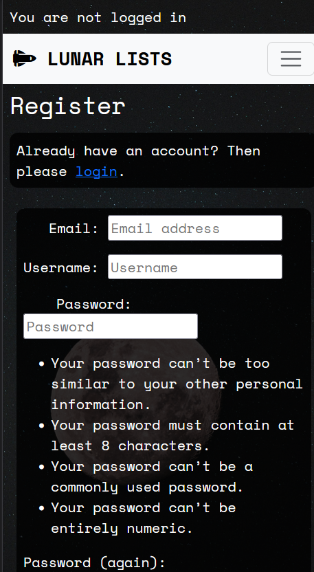
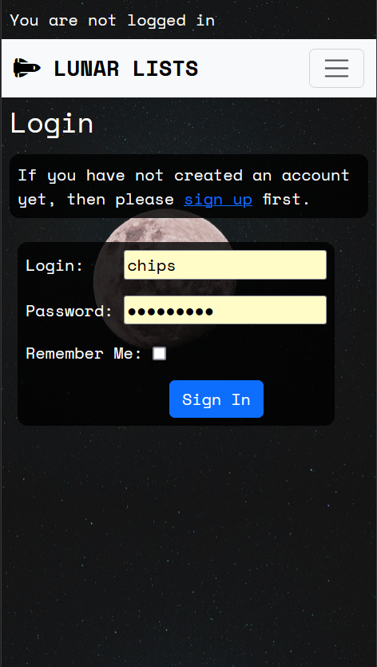
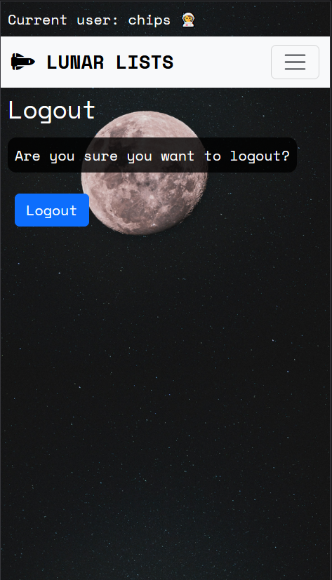
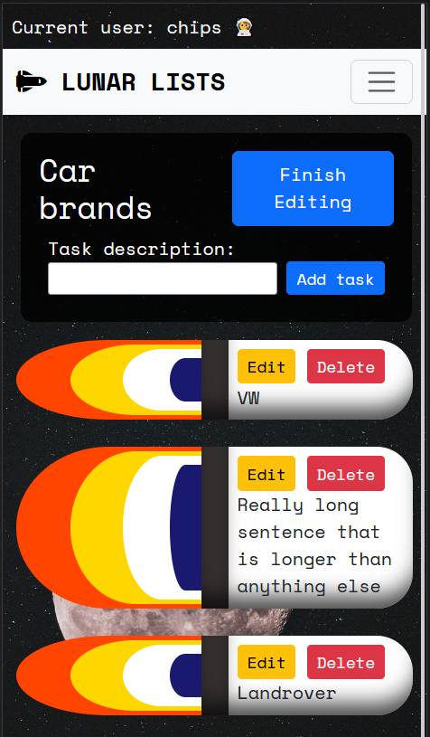
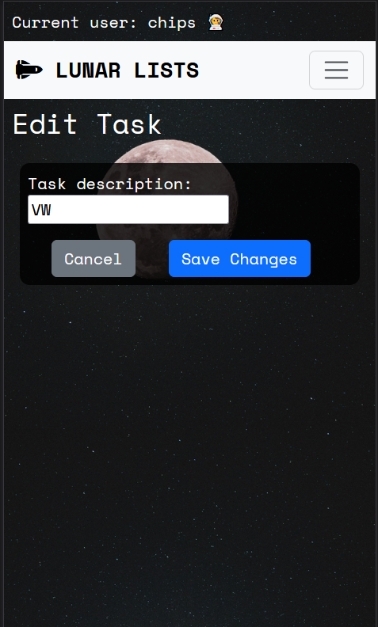

# Lunar Lists
### A to-do list website
Lunar lists allows users to create to-do lists for any task with the addition of a fun and friendly space theme. Whether you are a busy person, or a forgetful one, you can use lunar lists to log all your tasks, set their due date, and mark them as completed when they're done. Your lunar lists are only available to you, so don't worry about people tampering with your lists.

## Index – Table of Contents
* [User Experience (UX)](#user-experience-ux) 
* [Features](#features)
* [Design](#design)
* [Agile](#agile)
* [Technologies Used](#technologies-used)
* [Testing](#testing)
* [Deployment](#deployment)
* [Credits](#credits)

## Testing
### Responsiveness
I used dev tools on firefox and set the responsive design mode to iPhone 11 pro (as it had the thinnest display). During development I focused on mobile first design to support the majority of web users. The important thing was to prevent the need to scroll horizontally on mobile view. Occassionally I had to remove the bootstrap class 'container' to prevent horizontal scrolling.
- The navbar turns into a burger bar on small screen sizes.
- The task entries take up the full width on small screen sizes, while only taking up a third on large screens.

Below are displayed screenshots of all the pages as they would appear on an iphone 11 pro:

### Validation
#### HTML
I tested all HTML templates via text input on [W3 HTML validator](https://validator.w3.org/). The table below was ticked off for each page tested:

| HTML page       | Pass? |
|-----------------|-------|
| index           | ✅     |
| logout          | ✅     |
| signup          | ✅     |
| login           | ✅     |
| account_settings| ✅     |
| password_change | ✅     |
| saved_lists     | ✅     |
| task_view       | ✅     |
| create_task     | ✅     |
| edit_task       | ✅     |

Two pages had errors which needed to be fixed: signup and password_change. The form created by Django AllAuth and inserted with the django template language caused four errors:

It appears these issues were caused by the `
` and `` element used by the django form insertion. Changing `{{ form.as_p }}` to `{{ form.as_div }}` fixed the errors, however it completely ruined the layout causing one of the fields to appear completely out of place. The only option left was to manually place all the labels and link to the individual form fields. After running the new code through the validator it showed no errors. I also tested the signup and password_change pages and found that they still functioned as they should.
- password_change code before and after fix:

- signup code before and after fix:

#### CSS
I tested the CSS using [W3 CSS validator](https://jigsaw.w3.org/css-validator/). Two parse errors were found relating to a nested media query. The errors were resolved by moving the media query to a new line. Bootstrap was the cause behind all 434 warnings; these relate to vendor extensions and variables not being statically checked.
- Validator before and after fixing:

#### Python pep8
I tested every python file using [CI Python Linter](https://pep8ci.herokuapp.com/). Not many violations were found, except for the ocasional whitespace and line length.
- urls.py before and after amendments:

- I left the following pep8 violations in the settings.py as the code could not be made shorter for the AUTH_PASSWORD_VALIDATORS:

### Manual Testing
#### base.html
| Feature                                                       | Pass? |
|---------------------------------------------------------------|-------|
| Clicking on the website name takes user to index              | ✅      |
| Clicking on 'Saved lists' takes user to saved_lists           | ✅      |
| Clicking on 'Account settings' takes user to account_settings | ✅      |
| Clicking on 'Logout' takes user to logout                     | ✅      |
| Clicking on 'Register' takes user to register                 | ✅      |
| Clicking on 'Login' takes user to login                       | ✅      |
| When user is not logged in 'You are not logged in' is displayed at page top| ✅      |
| When user is logged in 'Current user: <user.name>' is displayed at page top| ✅      |

#### Homepage
| Feature                                                       | Pass? |
|---------------------------------------------------------------|-------|
| Clicking on the website name takes user to index              | ✅      |
| Clicking on 'Saved lists' takes user to saved_lists           | ✅      |
| Clicking on 'Account settings' takes user to account_settings | ✅      |
| Clicking on 'Logout' takes user to logout                     | ✅      |
| Clicking on 'Register' takes user to register                 | ✅      |
| Clicking on 'Login' takes user to login                       | ✅      |

#### Saved_lists
| Feature                                                                  | Pass? |
|--------------------------------------------------------------------------|-------|
| When user has no lists tutorial message is displayed                     | ✅      |
| Users lists are displayed in a table, with instructions below            | ✅      |
| Clicking on a list name takes user to  task_view of that particular list | ✅      |
| Clicking on 'click to create a new lunar list' shows form                | ✅      |
| User can create a list with a custom name and due date                   | ✅      |
| Clicking create takes user to create_task                                | ✅      |

#### task_view

#### create_task

#### edit_task

#### account_settings

## Deployment

- The site was deployed to Heroku. The steps to deploy are as follows:
  1. Install the gunicorn python package and create a file called 'Procfile' in the repo's root directory
  2. In the Procfile write 'web: gunicorn lunar_lists.wsgi'
  3. In settings.py add ".herokuapp.com" to the ALLOWED_HOSTS list
  4. In settings.py add 'https://*.herokuapp.com' to CSRF_TRUSTED_ORIGINS list
  5. git add, commit and push to github
  6. Navigate to the Heroku dashboard
  7. Create a new Heroku app
  8. Give it a name and select the region 'Europe'
  9. Navigate to settings tab and scroll down to Config Vars
  10. Click 'Reveal Config Vars'
  11. Add the following keys:
      - key = DATABASE_URL | value = (my secret database url)
      - key = SECRET_KEY | value = (my secret key)
  12. Navigate to Deploy tab
  13. Connect to GitHub and select the repo 'lunar-lists'
  14. Scroll down to 'Manual deploy' and select the 'main' branch
  15. Click 'Deploy Branch'
 
The live link can be found here - https://lunar-lists-658001c5b8b7.herokuapp.com/

## Credits
### Images
- The moon background image was downloaded from https://unsplash.com/.
### Code
- The following were adjusted from bootstrap 5.3:
  - The navbar
  - The modal delete warning
- The following were adjusted from django allauth:
  - login.html
  - logout.html
  - password_change.html
  - signup.html
- The following were adjusted from the code institute tutorial project 'Django Blog':
  - Django message notifications
  - User login status