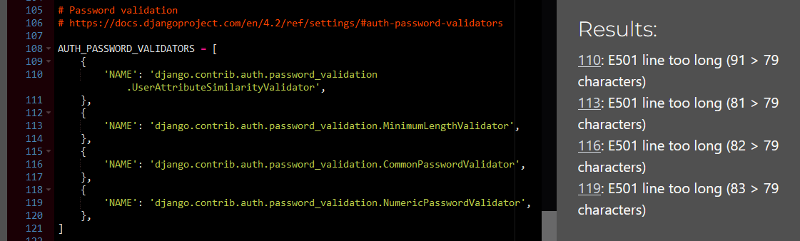

# Lunar Lists
### A to-do list website
Lunar lists allows users to create to-do lists for any task with the addition of a fun and friendly space theme. Whether you are a busy person, or a forgetful one, you can use lunar lists to log all your tasks, set their due date, and mark them as completed when they're done. Your lunar lists are only available to you, so don't worry about people tampering with your lists.

## Index – Table of Contents
* [User Experience (UX)](#user-experience-ux) 
* [Features](#features)
* [Design](#design)
* [Agile](#agile)
* [Technologies Used](#technologies-used)
* [Testing](#testing)
* [Deployment](#deployment)
* [Credits](#credits)

## Testing
### Responsiveness

### Validation
#### CSS
I tested the CSS using the [W3 CSS validator](https://jigsaw.w3.org/css-validator/). Two parse errors were found relating to an embedded media query. The errors were resolved by moving the media query to a new line. Bootstrap was the cause behind all 434 warnings; these relate to vendor extensions and variables not being statically checked.
- Validator before and after fixing:

#### Python pep8
I tested every python file using [CI Python Linter](https://pep8ci.herokuapp.com/). Not many violations were found, except for the ocasional whitespace and line length.
- urls.py before and after amendments:

- I left the following pep8 violations in the settings.py as the code could not be made shorter for the AUTH_PASSWORD_VALIDATORS:

### Manual Testing

## Deployment

- The site was deployed to Heroku. The steps to deploy are as follows:
  1. Install the gunicorn python package and create a file called 'Procfile' in the repo's root directory
  2. In the Procfile write 'web: gunicorn lunar_lists.wsgi'
  3. In settings.py add ".herokuapp.com" to the ALLOWED_HOSTS list
  4. In settings.py add 'https://*.herokuapp.com' to CSRF_TRUSTED_ORIGINS list
  5. git add, commit and push to github
  6. Navigate to the Heroku dashboard
  7. Create a new Heroku app
  8. Give it a name and select the region 'Europe'
  9. Navigate to settings tab and scroll down to Config Vars
  10. Click 'Reveal Config Vars'
  11. Add the following keys:
      - key = DATABASE_URL | value = (my secret database url)
      - key = SECRET_KEY | value = (my secret key)
  12. Navigate to Deploy tab
  13. Connect to GitHub and select the repo 'lunar-lists'
  14. Scroll down to 'Manual deploy' and select the 'main' branch
  15. Click 'Deploy Branch'
 
The live link can be found here - https://lunar-lists-658001c5b8b7.herokuapp.com/

## Credits
### Images
- The moon background image was downloaded from https://unsplash.com/.
### Code
- The following were adjusted from bootstrap 5.3:
  - The navbar
  - The modal delete warning
- The following were adjusted from django allauth:
  - login.html
  - logout.html
  - password_change.html
  - signup.html
- The following were adjusted from the code institute tutorial project 'Django Blog':
  - Django message notifications
  - User login status