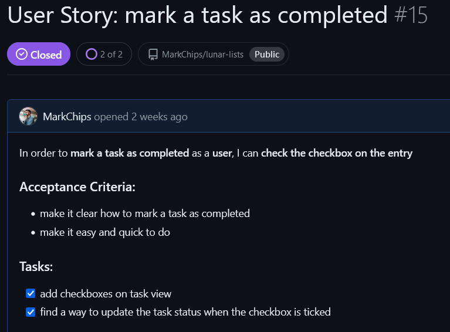

# Lunar Lists
### A to-do list website
Lunar lists allows users to create to-do lists for any task with the addition of a fun and friendly space theme. Whether you are a busy person, or a forgetful one, you can use lunar lists to log all your tasks, set their due date, and mark them as completed when they're done. Your lunar lists are only available to you, so don't worry about people tampering with your lists.

The live website can be viewed here: https://lunar-lists-658001c5b8b7.herokuapp.com/

## Index – Table of Contents
* [User Experience (UX)](#user-experience-ux) 
* [Features](#features)
* [Design](#design)
* [Agile](#agile)
* [Technologies Used](#technologies-used)
* [Testing](#testing)
* [Deployment](#deployment)
* [Credits](#credits)

## User Experience (UX)
### Database Planning
I used Lucidchart to create an ERD (entity relationship diagram). My project only required three models: User, List, and Task. The User model was imported from Django AllAuth. The primary key ids are created by django, so do not need to be written out in models.py. There are two data elements, belonging to the List model, that I did not use in the final deployment: total_tasks and completed_tasks. These are planned for a future feature.

### The Purpose and Target Audience
#### Problem Statement
There are many busy people out there with so many tasks on hand that they can't keep up. There are also many forgetful people out there who won't remember what needs to be done unless it is written down.

#### Purpose
My website aims to allow users to quickly list all the tasks for a given day and mark each task as completed when finished.

#### Target Audience
Someone who wants to better organise their tasks for each day. Busy people, forgetful people. Given the space theme, it will appeal more so to a younger audience.

#### Personal Target
To create a django website that facilitates all CRUD features, and looks pleasing to the eye.

### User stories
In total I created 24 user stories and closed 17 of them. The rest have been added to the 'Future Features' list. I started off by writing out the user stories on a google document. I also included the moscow ranking beside each user story.

Every user story that I added to my kanban board, I made sure to add acceptance criteria and a list of task tickboxes. Below I have included some key user stories that helped me reach my goals.

- I wanted the list creation to be minimal so that lists can be created quickly and with ease. The task list helped me think where to start. After a while I understood that first you create the models, then the view, urls, and finally the template.

- During development I talked to various friends and family members about my website, and it became clear that it wasn't obvious enough of what the website could be used for. For this reason I thought it important to provide example cases and a display example.

- From feedback it became clear that having just a list of items to-do without being able to cross them off was not that useful. For this reason I felt it important to be able to mark items as completed. It took a few iterations before I was able to make the checkboxes update the correct task, remain checked, and allow for unchecking.

## Features
### Create
- Create an account
  - email must be unique
  - password must match criteria
  - password is repeated as an additional check
- Create a list
  - give it a custom title, does not need to be unique
  - option to add due_by date
    - default due date is the current day
- Create tasks on the list

### Read
- See all created lists listed in a table
  - numbered on the left
  - list titles link to task_view
  - due_by displayed
  - created_on displayed in BST/GMT
- View an individual list and all of the tasks belonging to it
  - list title displayed at top
  - due_by displayed as top
  - each entry displayed on its own rocket div
- logged in user's username is displayed at the top of the page

### Update
- Edit individual tasks changing their text
  - text field prepopulates with current task description
  - the option to cancel change and return to create_task
- Mark tasks as completed
  - tasks can be checked and unchecked
  - is_completed status is remembered when you return to the list
- Change user password
  - requires previous password for security
  - password must match criteria
  - password is repeated as an additional check

### Delete
- Delete list
  - all tasks belonging to the list are deleted with the list
  - confirmation modal is displayed before deletion is made
- Delete task entry
  - confirmation modal is displayed before deletion is made
- Delete user account
  - all tasks and lists belonging to the user are also deleted
  - confirmation modal is displayed before deletion is made

### Notifications displayed when user:
- creates an account
- deletes an account
- creates a list
- deletes a list
- creates a task
- deletes a task
- edits a task

### Requires correct request user for:
- delete an account
- create a list
- delete a list
- create a task
- delete a task
- edit a task

### Additional features:
- user can login to their account using their email or username and password
- user can logout
- buttons displayed on index.html change depending on login status
- message displayed on saved_list changes depending on whether user has a list or not
- message displays on create_task if user has not created a task yet
- navigation bar
  - if user is not logged in it displays register and login links
  - if user is logged in it displays 'saved lists', 'account settings', and 'logout' links
  - navigation bar changes to burger bar menu if on smaller screens

### Future features:
- display tally total of tasks on a list and how many tasks have been completed
- display task/list/user name on delete confirmation modal
- allow users to change their email address
- allow tasks to be reordered in task_view
- sort saved_lists by date or name
- allow for tasks to be numbered by priority
- add email verification

## Design
### Wireframes
I used Balsamiq to create an MVP wireframe. The wireframes were to give an idea of what pages were needed, the buttons, and the general layout. I did not add any colour elements to the wireframes.

#### Homepage
- In the final deployment I included more text on the homepage to better explain the use of the website.

#### Create an account
- Change email address is a planned future feature.

#### Login
- In the deployed website, the user can login using their email address or their username.

#### Saved lists
- 'Done tasks' is a planned future feature that would tally up the completed tasks out of the total tasks for each list.

#### Task view
- In the deployed webiste, I have combined the 'add task' and 'edit' button on the task_view page. This button takes the user to the create_task page.

#### Create list
- In the deployed website, lists can now be created from the saved_lists page, negating the need for a separate page.

#### Edit list
- In the deployed website, I managed to move delete and edit buttons onto each entry. This proved to be more intuitive for users to select the desired task entry.

#### Edit entry
- This wireframe is very close to the final edit_task page. I found that the page did not needed to be overcomplicated.

#### Account settings
- 'Change email address' button is a planned future feature. I originally tried implementing the button with Django AllAuth, however it proved to be impossible to remove the verification email feature from the Django AllAuth email.html template.

#### Confirmation screen
- In the deployed website, instead of using a confirmation page, I have used a bootstrap modal. The modal does not specify the list name or entry name, this is a planned future feature.

## Agile
Throughout this project I took an agile approach. I created user stories to justify all design choices from the user perspective. I focused on the MVP before adding additional features, and improving them through iterations. I monitored my progress by using a kanban board on github projects, which can be found here: https://github.com/users/MarkChips/projects/5/views/1

### Kanban Board
The Kanban board served as a visual representation of the project's progress and allowed for effective task management. It consisted of the following sections:

- Backlog: This section contained all of the tasks and user stories that were yet to be prioritized for implementation.
- Ready: Many tasks required other tasks to be implemented first. With this in mind, I would add tasks to this column once it was possible to work on them.
- In Progress: Work in progress was tracked here, indicating tasks actively being worked on.
- In Review: Any tasks that I felt were not fully implemented or had any issues, I would add to this column to be revisited.
- Done: Tasks that did not require any further work were moved into this column.
- Future Features: Ideas and tasks earmarked for future development were kept in this column for consideration in subsequent iterations.

### MOSCOW Prioritisation
All user stories were assigned a moscow prioritisation to determine which user stories needed to be worked on first. Using github projects I created labels for each moscow rank and assigned them to each user story. I made these visible on the project page so that I could easily spot the priorities. All items required for the MVP were given the 'Must have' rank.

## Technologies Used
- HTML
- CSS
- Python
  - asgiref==3.8.1
  - gunicorn==20.1.0
  - oauthlib==3.2.2
  - psycopg==3.2.1
  - PyJWT==2.9.0
  - python3-openid==3.2.0
  - requests-oauthlib==2.0.0
  - sqlparse==0.5.1
  - urllib3==1.26.19
  - whitenoise==5.3.0
- Django
  - dj-database-url==0.5.0
  - Django==4.2.14
  - django-allauth==0.57.2
- Bootstrap 5.3
- Fontawsome
- Google fonts
- Balsamiq
- Heroku
- Git
- GitHub
- GitHub projects
- Lucid charts

## Testing
### Responsiveness
I used dev tools on firefox and set the responsive design mode to iPhone 11 pro (as it had the thinnest display). During development I focused on mobile first design to support the majority of web users. The important thing was to prevent the need to scroll horizontally on mobile view. Occassionally I had to remove the bootstrap class 'container' to prevent horizontal scrolling.
- The navbar turns into a burger bar on small screen sizes.
- The task entries take up the full width on small screen sizes, while only taking up a third on large screens.

I went page by page testing the responsiveness, and only moving on once satisfied:
| HTML page       | Pass? |
|-----------------|-------|
| index           | ✅     |
| logout          | ✅     |
| signup          | ✅     |
| login           | ✅     |
| account_settings| ✅     |
| password_change | ✅     |
| saved_lists     | ✅     |
| task_view       | ✅     |
| create_task     | ✅     |
| edit_task       | ✅     |

Below are example screenshots of key pages as they would appear on an iphone 11 pro vs how they appear on my desktop screen:

#### index.html:

#### saved_lists.html:

#### task_view.html:

### Validation
#### HTML
I tested all HTML templates via text input on [W3 HTML validator](https://validator.w3.org/). The table below was ticked off for each page tested:

| HTML page       | Pass? |
|-----------------|-------|
| index           | ✅     |
| logout          | ✅     |
| signup          | ✅     |
| login           | ✅     |
| account_settings| ✅     |
| password_change | ✅     |
| saved_lists     | ✅     |
| task_view       | ✅     |
| create_task     | ✅     |
| edit_task       | ✅     |

Two pages had errors which needed to be fixed: signup and password_change. The form created by Django AllAuth and inserted with the django template language caused four errors:

It appears these issues were caused by the `
` and `` element used by the django form insertion. Changing `{{ form.as_p }}` to `{{ form.as_div }}` fixed the errors, however it completely ruined the layout causing one of the fields to appear completely out of place. The only option left was to manually place all the labels and link to the individual form fields. After running the new code through the validator it showed no errors. I also tested the signup and password_change pages and found that they still functioned as they should.
- password_change code before and after fix:

- signup code before and after fix:

#### CSS
I tested the CSS using [W3 CSS validator](https://jigsaw.w3.org/css-validator/). Two parse errors were found relating to a nested media query. The errors were resolved by moving the media query to a new line. Bootstrap was the cause behind all 434 warnings; these relate to vendor extensions and variables not being statically checked.
- Validator before and after fixing:

#### Python pep8
I tested every python file using [CI Python Linter](https://pep8ci.herokuapp.com/). Not many violations were found, except for the ocasional whitespace and line length.
- urls.py before and after amendments:

- I left the following pep8 violations in the settings.py as the code could not be made shorter for the AUTH_PASSWORD_VALIDATORS:

#### Lighthouse
I used opera dev tools lighthouse benchmark to test for accessibility, best practices, and SEO (search engine optimisation). 

I was able to improve the SEO by adding meta description and meta keywords into the head element. I also replaced divs with section elements. 

I improved the accessibility by making sure that the checkboxes are connected to labels, and that aria-labels are used for the website name and sample cases checkboxes. 

I compressed the background image from 3mb to 1mb using https://tinypng.com/. In future I plan on working more on mobile performance since this was less than the desktop performance.

### Manual Testing
#### base.html
| Feature                                                       | Pass? |
|---------------------------------------------------------------|-------|
| Clicking on the website name takes user to index              | ✅      |
| Clicking on 'Saved lists' takes user to saved_lists           | ✅      |
| Clicking on 'Account settings' takes user to account_settings | ✅      |
| Clicking on 'Logout' takes user to logout                     | ✅      |
| Clicking on 'Register' takes user to register                 | ✅      |
| Clicking on 'Login' takes user to login                       | ✅      |
| When user is not logged in 'You are not logged in' is displayed at page top| ✅      |
| When user is logged in 'Current user: <user.name>' is displayed at page top| ✅      |

#### Homepage
| Feature                                                       | Pass? |
|---------------------------------------------------------------|-------|
| Clicking on the website name takes user to index              | ✅      |
| Clicking on 'Saved lists' takes user to saved_lists           | ✅      |
| Clicking on 'Account settings' takes user to account_settings | ✅      |
| Clicking on 'Logout' takes user to logout                     | ✅      |
| Clicking on 'Register' takes user to register                 | ✅      |
| Clicking on 'Login' takes user to login                       | ✅      |

#### Saved_lists
| Feature                                                                  | Pass? |
|--------------------------------------------------------------------------|-------|
| When user has no lists tutorial message is displayed                     | ✅      |
| Users lists are displayed in a table, with instructions below            | ✅      |
| Clicking on a list name takes user to  task_view of that particular list | ✅      |
| Clicking on 'click to create a new lunar list' shows form                | ✅      |
| User can create a list with a custom name and due date                   | ✅      |
| Clicking create takes user to create_task                                | ✅      |

#### task_view
| Feature                                                  | Pass? |
|----------------------------------------------------------|-------|
| Clicking on a checkbox updates task to 'is completed'    | ✅      |
| Unchecking a checkbox updates task to not 'is completed' | ✅      |
| Checkboxes remain ticked when revisiting task_view       | ✅      |
| Clicking 'edit list' takes user to create_task           | ✅      |
| Clicking 'delete list' opens modal                       | ✅      |
| Clicking 'delete list' from within modal deletes list    | ✅      |
| List title and due_by are displayed                      | ✅      |

#### create_task
| Feature                                                                     | Pass? |
|-----------------------------------------------------------------------------|-------|
| Clicking 'finish editing' takes user back to saved_lists                    | ✅      |
| User can enter task into text field and add task                            | ✅      |
| Clicking 'edit' takes user to edit_task for the particular task             | ✅      |
| Clicking 'delete' opens a confirmation modal                                | ✅      |
| Clicking 'delete task' from within the modal deletes the task from the list | ✅      |

#### edit_task
| Feature                                            | Pass? |
|----------------------------------------------------|-------|
| Clicking 'cancel' takes user back to create_task   | ✅      |
| Task description field prepopulates with task text | ✅      |
| User can change text and save changes              | ✅      |

#### account_settings
| Feature                                                    | Pass? |
|------------------------------------------------------------|-------|
| User can change password                                   | ✅      |
| Clicking 'delete account' brings up confirmation modal     | ✅      |
| Clicking 'delete account' within the modal deletes account | ✅      |
| User cannot view another user's list                       | ✅      |
| Logged out user cannot manipulate another user's lists     | ✅      |

## Deployment

- The site was deployed to Heroku. The steps to deploy are as follows:
  1. Install the gunicorn python package and create a file called 'Procfile' in the repo's root directory
  2. In the Procfile write 'web: gunicorn lunar_lists.wsgi'
  3. In settings.py add ".herokuapp.com" to the ALLOWED_HOSTS list
  4. In settings.py add 'https://*.herokuapp.com' to CSRF_TRUSTED_ORIGINS list
  5. git add, commit and push to github
  6. Navigate to the Heroku dashboard
  7. Create a new Heroku app
  8. Give it a name and select the region 'Europe'
  9. Navigate to settings tab and scroll down to Config Vars
  10. Click 'Reveal Config Vars'
  11. Add the following keys:
      - key = DATABASE_URL | value = (my secret database url)
      - key = SECRET_KEY | value = (my secret key)
  12. Navigate to Deploy tab
  13. Connect to GitHub and select the repo 'lunar-lists'
  14. Scroll down to 'Manual deploy' and select the 'main' branch
  15. Click 'Deploy Branch'
 
The live link can be found here - https://lunar-lists-658001c5b8b7.herokuapp.com/

## Credits
### Images
- The moon background image was downloaded from https://unsplash.com/.
### Code
- The following were adjusted from bootstrap 5.3:
  - The navbar
  - The modal delete warning
- The following were adjusted from django allauth:
  - login.html
  - logout.html
  - password_change.html
  - signup.html
- The following were adjusted from the code institute tutorial project 'Django Blog':
  - Django message notifications
  - User login status
  - Referenced for how to write developer comments on python
- https://www.perplexity.ai/ used for the following:
  - explain error messages
  - explain how pieces of code work
  - explain how to implement certain features
  - primarily used for views.py
- https://www.w3schools.com/
  - revision on css, html, and django
### README
 - Inspiration taken from [sojourn scribbles V3](https://github.com/katiejanecoughlan/sojourn-scribbles-V3/blob/main/README.md#agile-development). Particularly for the Kanban Board section.
 - Inspiration taken from [the bear directory blog](https://github.com/Gordon-Meade/thebearadirectoryblog/blob/main/README.md#features-implemented)