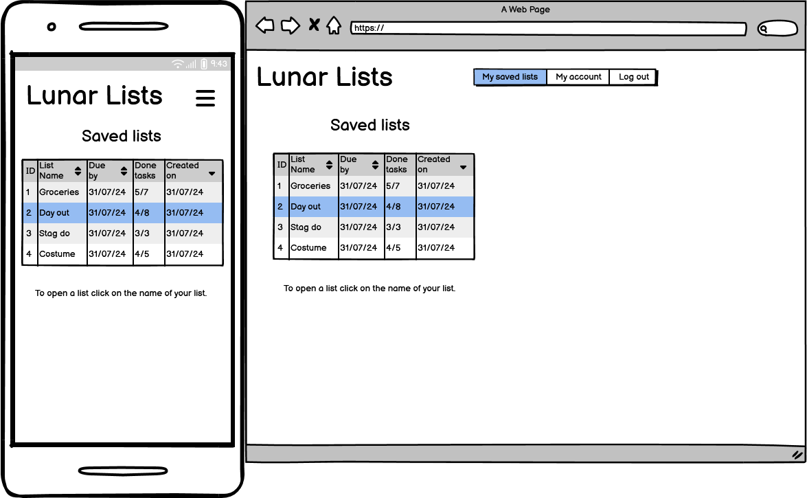

# Lunar Lists
### A to-do list website
Lunar lists allows users to create to-do lists for any task with the addition of a fun and friendly space theme. Whether you are a busy person, or a forgetful one, you can use lunar lists to log all your tasks, set their due date, and mark them as completed when they're done. Your lunar lists are only available to you, so don't worry about people tampering with your lists.

## Index – Table of Contents
* [User Experience (UX)](#user-experience-ux) 
* [Features](#features)
* [Design](#design)
* [Agile](#agile)
* [Technologies Used](#technologies-used)
* [Testing](#testing)
* [Deployment](#deployment)
* [Credits](#credits)

## User Experience (UX)
### Database Planning
I used Lucidchart to create an ERD (entity relationship diagram). My project only required three models: User, List, and Task. The User model was imported from Django AllAuth. The primary key ids are created by django, so do not need to be written out in models.py. There are two data elements, belonging to the List model, that I did not use in the final deployment: total_tasks and completed_tasks. These are planned for a future feature.

### The Purpose and Target Audience
#### Problem Statement
I find myself to be very busy, so busy that I forget what needs to be done.

#### Purpose
A website which helps users keep track of their daily tasks.

#### Target Audience
Someone who wants to better organise their tasks for each day. Busy people, forgetful people. People with a failing memory like my dad.

### Wireframes
I used Balsamiq to create an MVP wireframe. The wireframes were to give an idea of what pages were needed, the buttons, and the general layout. I did not add any colour elements to the wireframes.

#### Homepage
- In the final deployment I included more text on the homepage to better explain the use of the website.

#### Create an account
- Change email address is a planned future feature.

#### Login
- In the deployed website, the user can login using their email address or their username.

#### Saved lists
- 'Done tasks' is a planned future feature that would tally up the completed tasks out of the total tasks for each list.

#### Task view
- In the deployed webiste, I have combined the 'add task' and 'edit' button on the task_view page. This button takes the user to the create_task page.

#### Create list
- In the deployed website, lists can now be created from the saved_lists page, negating the need for a separate page.

#### Edit list
- In the deployed website, I managed to move delete and edit buttons onto each entry. This proved to be more intuitive for users to select the desired task entry.

#### Edit entry
- This wireframe is very close to the final edit_task page. I found that the page did not needed to be overcomplicated.

#### Account settings
- 'Change email address' button is a planned future feature. I originally tried implementing the button with Django AllAuth, however it proved to be impossible to remove the verification email feature from the Django AllAuth email.html template.

#### Confirmation screen
- In the deployed website, instead of using a confirmation page, I have used a bootstrap modal. The modal does not specify the list name or entry name, this is a planned future feature.

## Testing
### Responsiveness
I used dev tools on firefox and set the responsive design mode to iPhone 11 pro (as it had the thinnest display). During development I focused on mobile first design to support the majority of web users. The important thing was to prevent the need to scroll horizontally on mobile view. Occassionally I had to remove the bootstrap class 'container' to prevent horizontal scrolling.
- The navbar turns into a burger bar on small screen sizes.
- The task entries take up the full width on small screen sizes, while only taking up a third on large screens.

Below are displayed screenshots of all the pages as they would appear on an iphone 11 pro:

### Validation
#### HTML
I tested all HTML templates via text input on [W3 HTML validator](https://validator.w3.org/). The table below was ticked off for each page tested:

| HTML page       | Pass? |
|-----------------|-------|
| index           | ✅     |
| logout          | ✅     |
| signup          | ✅     |
| login           | ✅     |
| account_settings| ✅     |
| password_change | ✅     |
| saved_lists     | ✅     |
| task_view       | ✅     |
| create_task     | ✅     |
| edit_task       | ✅     |

Two pages had errors which needed to be fixed: signup and password_change. The form created by Django AllAuth and inserted with the django template language caused four errors:

It appears these issues were caused by the `
` and `` element used by the django form insertion. Changing `{{ form.as_p }}` to `{{ form.as_div }}` fixed the errors, however it completely ruined the layout causing one of the fields to appear completely out of place. The only option left was to manually place all the labels and link to the individual form fields. After running the new code through the validator it showed no errors. I also tested the signup and password_change pages and found that they still functioned as they should.
- password_change code before and after fix:

- signup code before and after fix:

#### CSS
I tested the CSS using [W3 CSS validator](https://jigsaw.w3.org/css-validator/). Two parse errors were found relating to a nested media query. The errors were resolved by moving the media query to a new line. Bootstrap was the cause behind all 434 warnings; these relate to vendor extensions and variables not being statically checked.
- Validator before and after fixing:

#### Python pep8
I tested every python file using [CI Python Linter](https://pep8ci.herokuapp.com/). Not many violations were found, except for the ocasional whitespace and line length.
- urls.py before and after amendments:

- I left the following pep8 violations in the settings.py as the code could not be made shorter for the AUTH_PASSWORD_VALIDATORS:

#### Lighthouse
I used opera dev tools lighthouse benchmark to test for accessibility, best practices, and SEO (search engine optimisation). I was able to improve the SEO by adding meta description and meta keywords into the head element. I also replaced divs with section elements. I improved the accessibility by making sure that the checkboxes are connected to labels, and that aria-labels are used for the website name and sample cases checkboxes. In future I plan on working more on mobile performance since this was less than the desktop performance.

### Manual Testing
#### base.html
| Feature                                                       | Pass? |
|---------------------------------------------------------------|-------|
| Clicking on the website name takes user to index              | ✅      |
| Clicking on 'Saved lists' takes user to saved_lists           | ✅      |
| Clicking on 'Account settings' takes user to account_settings | ✅      |
| Clicking on 'Logout' takes user to logout                     | ✅      |
| Clicking on 'Register' takes user to register                 | ✅      |
| Clicking on 'Login' takes user to login                       | ✅      |
| When user is not logged in 'You are not logged in' is displayed at page top| ✅      |
| When user is logged in 'Current user: <user.name>' is displayed at page top| ✅      |

#### Homepage
| Feature                                                       | Pass? |
|---------------------------------------------------------------|-------|
| Clicking on the website name takes user to index              | ✅      |
| Clicking on 'Saved lists' takes user to saved_lists           | ✅      |
| Clicking on 'Account settings' takes user to account_settings | ✅      |
| Clicking on 'Logout' takes user to logout                     | ✅      |
| Clicking on 'Register' takes user to register                 | ✅      |
| Clicking on 'Login' takes user to login                       | ✅      |

#### Saved_lists
| Feature                                                                  | Pass? |
|--------------------------------------------------------------------------|-------|
| When user has no lists tutorial message is displayed                     | ✅      |
| Users lists are displayed in a table, with instructions below            | ✅      |
| Clicking on a list name takes user to  task_view of that particular list | ✅      |
| Clicking on 'click to create a new lunar list' shows form                | ✅      |
| User can create a list with a custom name and due date                   | ✅      |
| Clicking create takes user to create_task                                | ✅      |

#### task_view
| Feature                                                  | Pass? |
|----------------------------------------------------------|-------|
| Clicking on a checkbox updates task to 'is completed'    | ✅      |
| Unchecking a checkbox updates task to not 'is completed' | ✅      |
| Checkboxes remain ticked when revisiting task_view       | ✅      |
| Clicking 'edit list' takes user to create_task           | ✅      |
| Clicking 'delete list' opens modal                       | ✅      |
| Clicking 'delete list' from within modal deletes list    | ✅      |
| List title and due_by are displayed                      | ✅      |

#### create_task
| Feature                                                                     | Pass? |
|-----------------------------------------------------------------------------|-------|
| Clicking 'finish editing' takes user back to saved_lists                    | ✅      |
| User can enter task into text field and add task                            | ✅      |
| Clicking 'edit' takes user to edit_task for the particular task             | ✅      |
| Clicking 'delete' opens a confirmation modal                                | ✅      |
| Clicking 'delete task' from within the modal deletes the task from the list | ✅      |

#### edit_task
| Feature                                            | Pass? |
|----------------------------------------------------|-------|
| Clicking 'cancel' takes user back to create_task   | ✅      |
| Task description field prepopulates with task text | ✅      |
| User can change text and save changes              | ✅      |

#### account_settings
| Feature                                                    | Pass? |
|------------------------------------------------------------|-------|
| User can change password                                   | ✅      |
| Clicking 'delete account' brings up confirmation modal     | ✅      |
| Clicking 'delete account' within the modal deletes account | ✅      |
| User cannot view another user's list                       | ✅      |
| Logged out user cannot manipulate another user's lists     | ✅      |

## Deployment

- The site was deployed to Heroku. The steps to deploy are as follows:
  1. Install the gunicorn python package and create a file called 'Procfile' in the repo's root directory
  2. In the Procfile write 'web: gunicorn lunar_lists.wsgi'
  3. In settings.py add ".herokuapp.com" to the ALLOWED_HOSTS list
  4. In settings.py add 'https://*.herokuapp.com' to CSRF_TRUSTED_ORIGINS list
  5. git add, commit and push to github
  6. Navigate to the Heroku dashboard
  7. Create a new Heroku app
  8. Give it a name and select the region 'Europe'
  9. Navigate to settings tab and scroll down to Config Vars
  10. Click 'Reveal Config Vars'
  11. Add the following keys:
      - key = DATABASE_URL | value = (my secret database url)
      - key = SECRET_KEY | value = (my secret key)
  12. Navigate to Deploy tab
  13. Connect to GitHub and select the repo 'lunar-lists'
  14. Scroll down to 'Manual deploy' and select the 'main' branch
  15. Click 'Deploy Branch'
 
The live link can be found here - https://lunar-lists-658001c5b8b7.herokuapp.com/

## Credits
### Images
- The moon background image was downloaded from https://unsplash.com/.
### Code
- The following were adjusted from bootstrap 5.3:
  - The navbar
  - The modal delete warning
- The following were adjusted from django allauth:
  - login.html
  - logout.html
  - password_change.html
  - signup.html
- The following were adjusted from the code institute tutorial project 'Django Blog':
  - Django message notifications
  - User login status